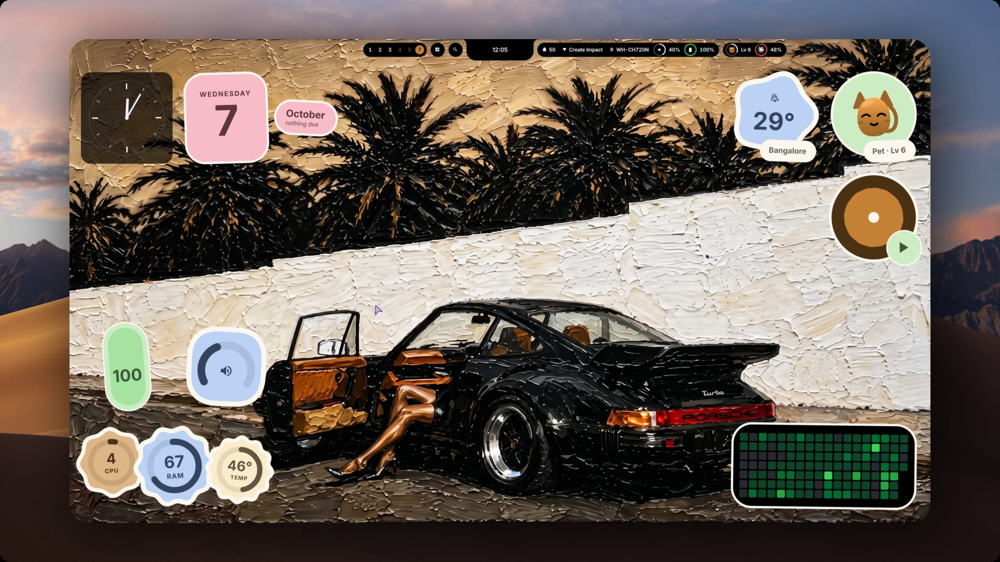
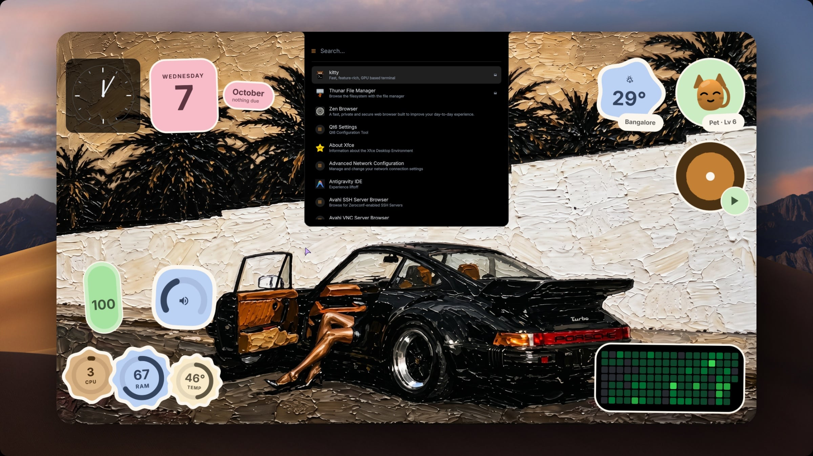
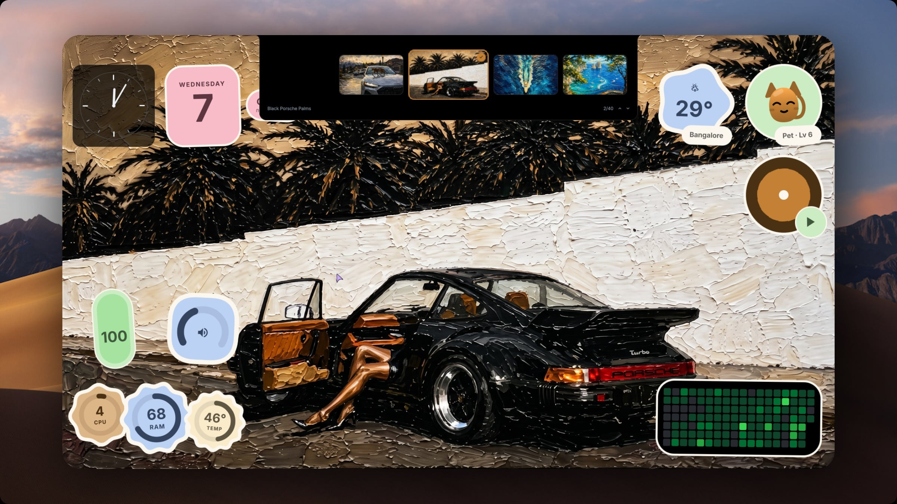
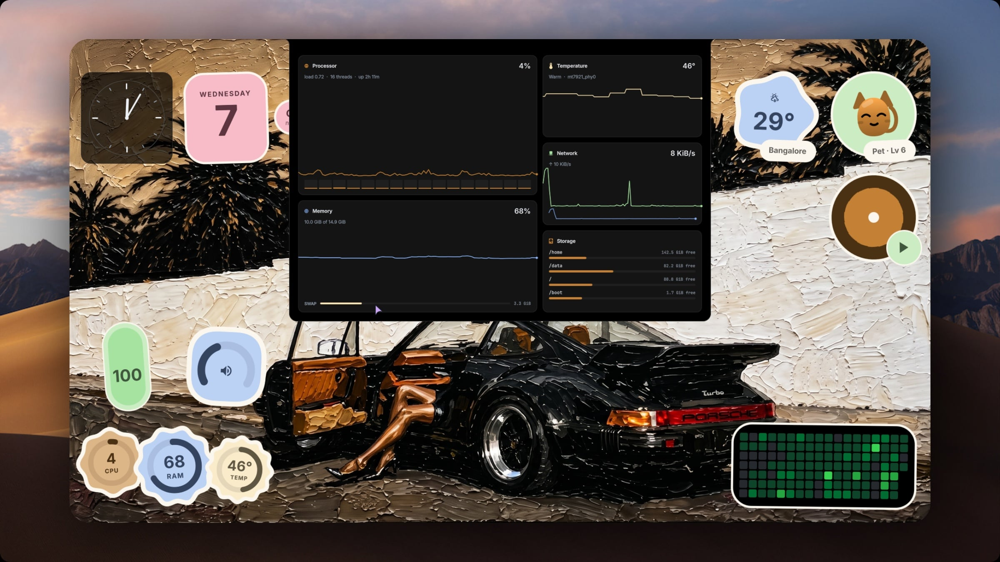
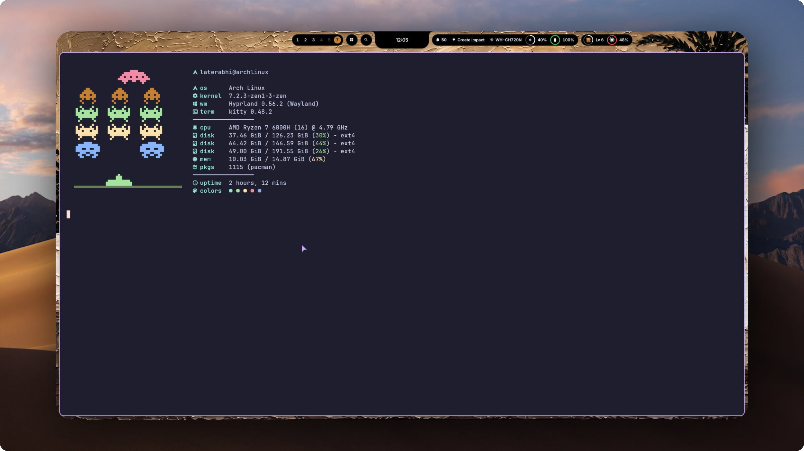

# Arch Linux Laptop Dotfiles

Personal configuration files for my Arch Linux laptop: Hyprland (Lua config) on Wayland with the [impasto](https://github.com/andreumassanet/impasto) Quickshell desktop shell, kitty, zsh and Neovim.



| | |
|---|---|
|  |  |
| App launcher | Wallpaper picker; the palette follows the wallpaper |
|  |  |
| System statistics | kitty with the fastfetch greeting |

Screenshots framed with [Screenshot Studio](https://github.com/opennookorg/screenshot-studio).

## Install on any Arch machine

On an Arch Linux install with `sudo` set up for your user, run as that user (not root):

```bash
git clone -b impasto-rice https://github.com/OfficialAbhinavSingh/arch-dotfiles.git ~/arch-dotfiles
cd ~/arch-dotfiles
./install.sh
```

Then log out and run `start-hyprland` from a TTY, or pick Hyprland in your display manager.

`install.sh` does the following, and asks before anything that changes the system:

- Installs the official packages the configs use with `pacman -Syu --needed`. This also updates the system.
- Installs a few optional AUR packages: the cursor theme, Zen Browser, wallust, mpvpaper and wl-kbptr. It builds `yay` first if you have neither `yay` nor `paru`. An AUR build that fails is reported and skipped.
- Copies the dotfiles into your home. Paths and the lock-screen name are rewritten for your user. Every file it replaces is moved to `~/.local/state/arch-dotfiles/backups/<timestamp>/` first.
- Downloads impasto at the commit these configs were built against, adds this repo's changes to it, and copies its wallpapers and fonts into `~/.local/share`.
- Installs oh-my-zsh, powerlevel10k and the two zsh plugins, and offers to make zsh your login shell.
- Enables `power-profiles-daemon`, `bluetooth` and `NetworkManager`. NetworkManager is left alone if another network manager is already enabled.
- On AMD laptops with an `amdgpu_bl1` backlight, it installs the fix in `system/` for a panel that stays black after boot.

It is safe to run again. Useful options:

| Option | Effect |
|---|---|
| `-n`, `--dry-run` | Show what would happen and change nothing |
| `-y`, `--yes` | Don't ask; take the default answer everywhere |
| `--skip-packages` | Copy configs only, install no packages |
| `--skip-aur` | Official-repo packages only |
| `--skip-system` | Don't touch system services or files outside your home |
| `--no-chsh` | Keep your current login shell |

To undo, copy the backup back: `cp -a ~/.local/state/arch-dotfiles/backups/<timestamp>/. ~/`.

## What it does not set up

- `monitors.lua` describes the original laptop's screens. Others get Hyprland's automatic layout. Edit it for your displays.
- Right Alt is remapped to the backtick key by `.config/hypr/keymap-ralt-grave.xkb`. Remove the `kb_file` line in `hyprland.lua` if you don't want that.
- `.gitconfig` is not installed. Set your own Git name, email and signing key.
- `.claude/` (Claude Code settings) and `.config/zen/user.js` (a Zen Browser profile template) are not installed.
- Tools installed outside pacman and the AUR are listed in [MANUAL-INSTALLS.md](MANUAL-INSTALLS.md).

## Credentials and privacy

Never put API keys, access tokens, passwords, private keys, or browser credentials in this repository. Local secret and credential files are excluded by `.gitignore`; keep them on the machine or in a password manager. Before pushing changes, review `git status` and the complete diff, especially newly added files.

This is a personal configuration repository. Review it for account details, local paths, and other information you do not want to publish before changing its visibility.

## Syncing this repository

The tracked `.local/bin/dot-sync.sh` script is for the original machine's bare-repository setup. It reads package lists from the current laptop and pushes through `~/.dotfiles`; it is not a general installer or sync command for a fresh clone. On another laptop, use normal Git commands in the cloned repository and configure its remote and identity first.
